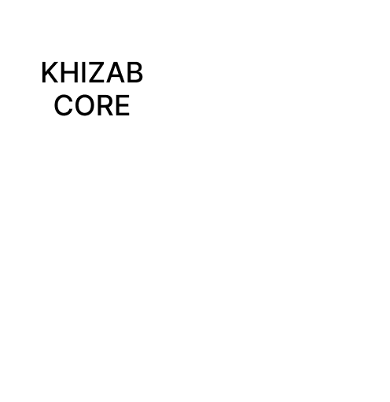
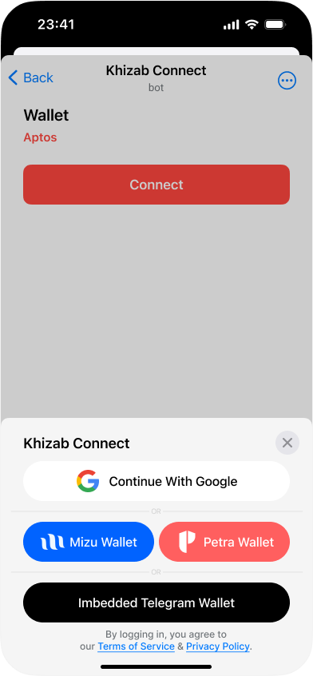
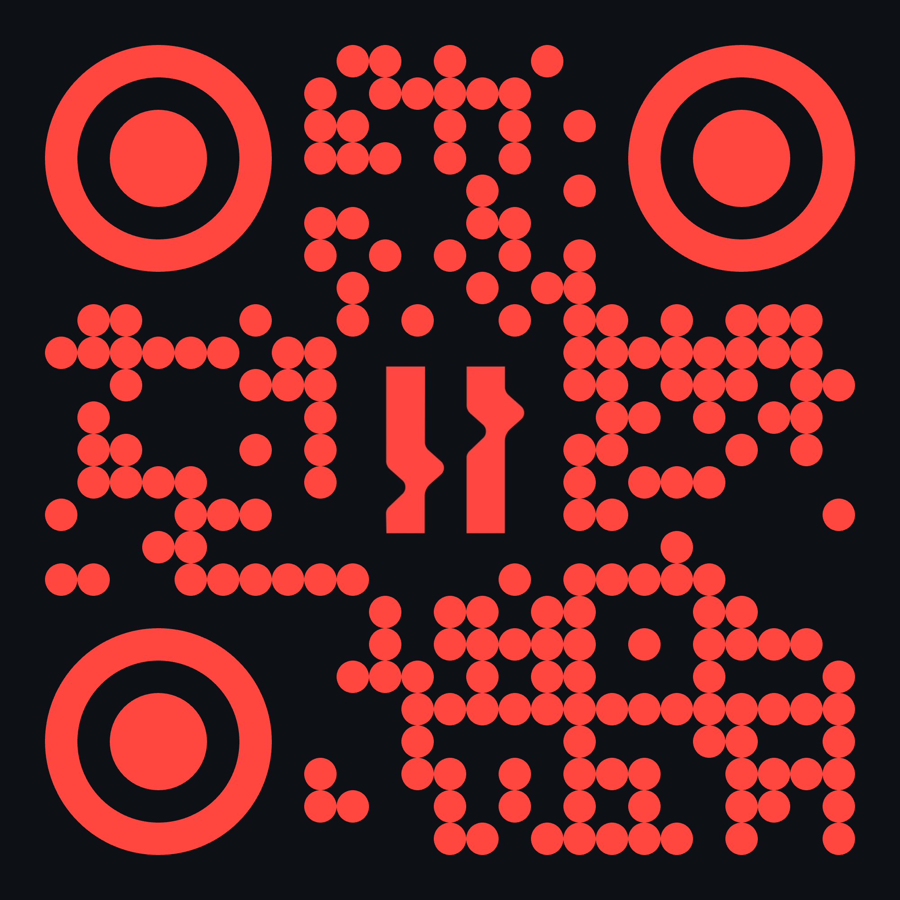
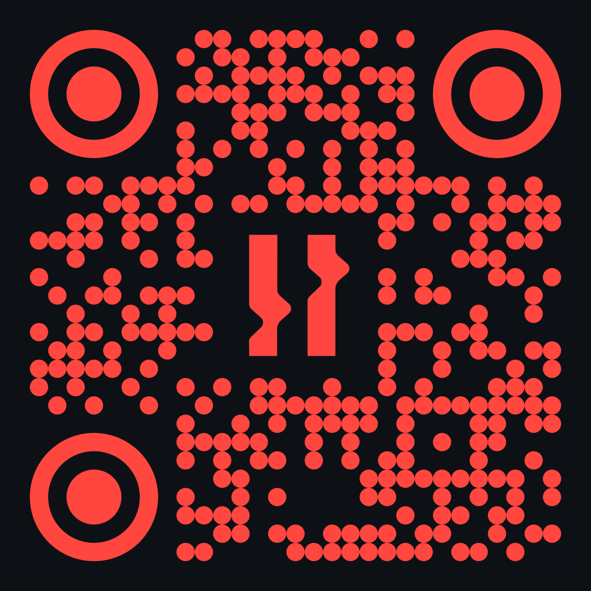

---
# You can also start simply with 'default'
# random image from a curated Unsplash collection by Anthony
theme: ./
# apply unocss classes to the current slide
# https://sli.dev/features/drawing
drawings:
  persist: false
# enable MDC Syntax: https://sli.dev/features/mdc
mdc: true
# take snapshot for each slide in the overview
overviewSnapshots: true
layout: image
image: ./assets/bg.jpg

hideInToc: true
---


<span class="abs-tl text-[8px] top-[3.3rem] left-[3.45rem]  text-zinc-200">Persian Word "Rising Wave"</span>

# KHIZAB

Reactivity for Aptos Apps


  <a href="https://github.com/rendinjast" target="_blank" alt="Rend Github" title="Rend Github" class="abs-br m-6 flex gap-1 border border-zinc-600 bg-black px-2 py-1 rounded-full text-[0.6rem]">
  <span class="text-white">By</span>
    <span>Erfan Khadivar</span>
</a>

---
hideInToc: true
layout: two-cols
---

# Table of contents
::right::
<Toc  listClass="!list-disc toc text-sm" minDepth="1" maxDepth="2" ></Toc>


---

# What is Khizab?

Khizab is a Type Safe, Extensible, and Modular by design **library** for building Reactive Aptos applications


<br>

- 🔗 **Wallet Adapter** - Manage multiple wallets with ease, track the app state in realtime

<br>

- 🛡️ **Type-Safe interfaces** - Infer types from ABIs and autocomplete your way to productivity.

<br>

- ⚛️ **React Hooks** - React Hooks for accounts, wallets, contracts, transactions, signing, and more.

<br>

- 🏗️ **CLI and Codegen** - Create Aptos Frontend projects with one command, Generate boilerplate

<br>

Read more [khizab.dev](https://khizab.dev)


---
level: 2
---

## 🔗 Wallet Adapter

<div class="flex flex-col items-center gap-2">
   
   <span>Khizab</span>
</div>


---
layout: two-cols
level: 3
---

Create your config. 

```ts 
// khizab.ts

import { createConfig } from 'khizab'
import { testnet } from 'khizab/networks'
import { petraWallet } from 'khizab/connectors'

export const config = createConfig({
  network: testnet,
  connectors: [petraWallet()],
})
```

 Khizab Provider

```tsx 

import { KhizabProvider } from 'khizab'
import { config } from '@/khizab'

// add KhizabProvider to your app
 <KhizabProvider config={config}>
 {...}
 </KhizabProvider>
```

::right::

 use Khizab hooks

```tsx {0|all}
useConnect()
useDisconnect()
useReconnect()
useAccount()
```

---
level: 2
---
## 🛡️ Type-Safe interfaces

- Adding typing and reactivity to Aptos SDK functions.

```ts
  const { data, status, error, isPending } = useAccountModules({
    accountAddress: '0x123',
  })
```

- Generate types for your ABI

```ts
const [count] = await readContract(config, {
 abi: abi,
 functionName: 'get_todo_list_counter',
 ags: [account.account.address],
})

```

 -  State of your write or read calls.

```ts
  const { writeContract } = useWriteContract()
writeContract({ 
  abi,
  functionName: 'create_todo_list',
  args: [],
})
```

---
level: 2
---
## ⚛️ React Hooks

<div class="grid grid-cols-4 ">

<span>useAccount</span>

<span>useAccountEffect</span>

<span>useAccountInfo</span>

<span>useAccountModule</span>

<span>useAccountModules</span>

<span>useAccountResource</span>

<span>useAccountResources</span>

<span>useAccountTransactions</span>

<span>useBalance</span>

<span>useBlockByHeight</span>

<span>useBlockByVersion</span>

<span>useClient</span>

<span>useConfig</span>

<span>useConnect</span>

<span>useConnections</span>

<span>useConnectors</span>

<span>useDisconnect</span>

<span>useConnector</span>

<span>useLedgerInfo</span>

<span>useTableItem</span>

<span>useTransaction</span>

<span>useTransactions</span>

<span>useReadContract</span>

<span>useReadContracts</span>

<span>useReconnect</span>

<span>useToken</span>

<span>useWriteContract</span>

</div>

---
hideInToc: true
---

## Core Actions

<div class="grid grid-cols-4 ">
<span>connect</span>

<span>disconnect</span>

<span>getAccount</span>

<span>getAccountInfo</span>

<span>getAccountModule</span>

<span>getAccountModules</span>

<span>getAccountResource</span>

<span>getAccountResources</span>

<span>getAccountTransactions</span>

<span>getBalance</span>

<span>getBlockByHeight</span>

<span>getBlockByVersion</span>

<span>getClient</span>

<span>getConnections</span>

<span>getConnector</span>

<span>getConnectors</span>

<span>getLedgerInfo</span>

<span>getTableItem</span>

<span>getToken</span>

<span>getTransaction</span>

<span>getTransactions</span>

<span>readContract</span>

<span>readContracts</span>

<span>reconnect</span>

<span>watchAccount</span>

<span>watchConnections</span>

<span>watchConnectors</span>

<span>writeContract</span>

</div>
---

React hook Example 


```ts
const { data, status, error } = useBalance({
  accountAddress: account?.address,
  coinType:
     '0x43417434fd869edee76cca2a4d2301e528a1551b1d719b75c350c3c97d15b8b9::coins::USDT',
})

```

Core Action Example

```ts
const usdt = await getBalance(config, {
  accountAddress: account.account.address,
  coinType:
  '0x43417434fd869edee76cca2a4d2301e528a1551b1d719b75c350c3c97d15b8b9::coins::USDT',
})
```

Response

```json
{
    "name": "Tether",
    "decimals": 6,
    "symbol": "USDT",
    "value": 0,
    "formatted": "0"
}
```

---
level: 2
title: 🏗️ CLI and Codegen
---
##  Create Khizab

 Khizab provides a CLI to create frontend projects with bare minimum boilerplate.

```bash
npm create khizab@latest
```

```bash
✔ Project name: … khizab-project
✔ Select a framework: › React
✔ Select a variant: › Next

Scaffolding project in /Users/rend/khizab-project...

Done. Now run:

  cd khizab-project
  pnpm install
  pnpm run dev
```

---
layout: two-cols
---

## Khizab CLI

 The CLI can automatically generate hooks and actions for your smart contract modules.

```bash
pnpm add -D @khizab/cli
```

Creates configuration file. 

```bash
khizab init
```


Generates code based on configuration, using contracts and plugins.

```bash
khizab generate
```

::right::

Modify the configuration file to your needs.

```ts
// khizab.ts
import { defineConfig } from '@khizab/cli'
import { react } from '@khizab/cli/plugins'
import { abi } from './abi'
 
export default defineConfig({
  out: 'src/generated.ts',
  contracts: [
    {
      name: 'TodoList',
      abi,
    },
  ],
  plugins: [
    react()
  ],
})
```


---

# Benefits 
 App developers should not need to worry about connecting tens of different wallets or calling a misspelled contract function, or accidentally spamming the network.


- 🧑‍💻 **Developer Experience** - A key design principle of Khizab is improving the developer experience. Khizab achieves this through a modular architecture similar to Wagmi which promotes simplicity and ease of use.


- ⚡ **Performance** - Performance is a critical factor in any application, and Khizab is optimized to ensure efficient execution. The library is designed to minimize bundle size, with support for tree-shaking and dead-code elimination.


- 🧩 **Feature Coverage** - Khizab supports the most popular and commonly-used Aptos Sdk features out of the box with 20+ React Hooks for accounts, wallets, contracts, transactions, and more.  Khizab also supports just about any wallet out there through it's official connectors, and extendable API.
<br>

Read more [khizab.dev/react/why](https://khizab.dev/react/why)


---
level: 2
---
## 🧑‍💻 Developer Experience


<br />

- Familiar APIs

<br />

- Modular and composable 

<br />

- Automatic type safety

<br />

- Clear documentation.


---
level: 2
---

## ⚡ Performance

###  Users Don't care about Aptos BlockChain Performance

Performance is a critical factor in any application, and Khizab is optimized to ensure efficient execution.
this library is designed to
- minimize bundle size
- support for tree-shaking
- dead-code elimination.

<br />
<br />

Khizab Optimizes data handling by providing built-in support for caching, deduplication, persistence, and much more through TanStack Query.

---
level: 2
---
## 🧩 Feature Coverage

- Khizab supports the most popular and commonly used Aptos SDK features out of the box with 20+ React Hooks for accounts, wallets, contracts, transactions, and more.

<br />

- Khizab also supports just about any wallet through its official connectors and extensible API.


<br />

- If you need lower-level control, you can always drop down to Khizab Core or Aptos SDK, you don't have any limitations.

<br />

---
layout: center
class: text-center
---

# Is it ready?

### let's code


<div class="abs-br text-xs right-4">
What could possibly go wrong :D
</div>


---

# The Future


<br>

- 📦 **Wrappers** - Khizab package itself is wrapper around Khizab core, so why not support more framework?

<br>

- 🛠️ **Maintenance** - Khizab is actively maintained, with a commitment to keeping the library up-to-date with changes in the Aptos ecosystem. This guarantees that developers using the library can rely on it as a stable foundation for building and scaling their applications.


<br>

- 🔗 **Khizab Connect** - Dynamic Wallet connection offers, Modal library for connecting a wallet to your dApp. 

--- 
level: 2
---

## 📦 Wrappers

The Khizab package itself is a wrapper around Khizab Core. Since the core package is designed to be as modular as possible with the help of TanStack Query, we can easily support more frameworks.

<br />
<br />
<br />

<svg class="w-24 h-24" viewBox="0 0 19 16" xmlns="http://www.w3.org/2000/svg"><path d="m14.8 0h3.7l-9.25 15.95625-9.25-15.95625h7.07625l2.17375 3.7 2.1275-3.7z" fill="#41b883"/><path d="m0 0 9.25 15.95625 9.25-15.95625h-3.7l-5.55 9.57375-5.59625-9.57375z" fill="#41b883"/><path d="m3.65375 0 5.59625 9.62 5.55-9.62h-3.4225l-2.1275 3.7-2.17375-3.7z" fill="#35495e"/></svg>

<svg class="h-24 w-24" height="308" preserveAspectRatio="xMidYMid" viewBox="0 0 256 308" width="256" xmlns="http://www.w3.org/2000/svg"><path d="m239.681566 40.706757c-28.568294-40.88864637-84.990676-53.008196-125.78675-27.0157177l-71.6479098 45.6644961c-19.570902 12.3124674-33.051091 32.2983189-37.13493731 55.0565976-3.41776368 18.959041-.41375109 38.516443 8.53642621 55.575772-6.13289834 9.30324-10.31580082 19.753395-12.2959039 30.718882-4.12332891 23.195311 1.27037857 47.073752 14.9634684 66.244657 28.5743379 40.892492 84.9969944 53.006822 125.7867504 27.015717l71.64791-45.664496c19.572285-12.311039 33.052933-32.297571 37.134937-55.056598 3.41731-18.958818.415653-38.515839-8.530108-55.577145 6.131299-9.303027 10.312445-19.75276 12.290685-30.717509 4.126054-23.1953736-1.267891-47.0748665-14.963469-66.244656" fill="#ff3e00"/><path d="m106.888658 270.841265c-23.1014725 6.0068-47.4971535-3.035919-61.1022469-22.648699-8.2386528-11.531546-11.484062-25.895993-9.0033153-39.849411.4158375-2.267741.9880975-4.50399 1.7126797-6.692722l1.3497005-4.115598 3.6718337 2.696928c8.4798204 6.230728 17.9611706 10.967965 28.0354106 14.007539l2.66368.808117-.2453751 2.658459c-.3254753 3.781973.698577 7.557047 2.8906451 10.656094 4.094361 5.907777 11.439466 8.633996 18.3968128 6.828187 1.557586-.416307 3.0422028-1.068775 4.4021887-1.934699l71.6709622-45.672742c3.545834-2.232755 5.989505-5.853489 6.733665-9.977122.742872-4.205548-.234798-8.533235-2.713415-12.011015-4.096808-5.909003-11.44375-8.636381-18.403957-6.832034-1.555535.416341-3.038177 1.068333-4.396418 1.933325l-27.34902 17.434272c-4.497208 2.859414-9.405052 5.01464-14.553519 6.391018-23.101278 6.006447-47.4965751-3.036361-61.1014229-22.648974-8.2389847-11.531293-11.4844292-25.895797-9.0033154-39.849136 2.4560427-13.689336 10.5657257-25.7105194 22.3393011-33.1140983l71.6646422-45.676589c4.499119-2.8641088 9.410469-5.0220447 14.563136-6.3987122 23.101129-6.0062931 47.496216 3.0363681 61.101148 22.648699 8.238653 11.5315465 11.484063 25.8959937 9.003316 39.8494112-.417631 2.2673473-.98986 4.5034733-1.71268 6.6927223l-1.3497 4.115598-3.669911-2.692807c-8.479223-6.234292-17.961484-10.9737028-28.037334-14.0135834l-2.66368-.8083914.245375-2.6584593c.322677-3.7816356-.701122-7.5556774-2.890645-10.6558191-4.094361-5.9077771-11.439466-8.6339968-18.396813-6.8281873-1.557586.4163071-3.042202 1.0687749-4.402188 1.9346989l-71.6709626 45.6746656c-3.5453478 2.230999-5.9876426 5.851504-6.7284436 9.974374-.7474696 4.205351.2285574 8.534589 2.7081937 12.012389 4.0968602 5.908936 11.443754 8.636297 18.403957 6.832034 1.5571995-.417161 3.0415995-1.069574 4.4019135-1.934699l27.345448-17.427677c4.495261-2.863184 9.402886-5.020319 14.55187-6.396239 23.101278-6.006447 47.496576 3.036361 61.101423 22.648974 8.238985 11.531293 11.484429 25.895797 9.003316 39.849136-2.457653 13.690047-10.566752 25.71226-22.339301 33.119319l-71.664918 45.672742c-4.499119 2.864109-9.410469 5.022045-14.563136 6.398712" fill="#fff"/></svg>

---
level: 2
---
## 🛠️ Maintenance

- We are here to stay 

- Makes sence


---
level: 2
layout: two-cols
---
## 🔗 Khizab Connect

Dynamic wallet offering solution based on the current user environment:

- Social passwordless connectors 
- Deep-link and remote connection 
- Custom headless UI 
- User management

::right::

<div class="flex flex-col items-center gap-2">

<span>Telegram Mini App</span>
</div>


---
layout: center
class: text-center
title: end
hideInToc: true
---


<span class="text-white text-center">If you have any questions or want to contribute to this project<br /> feel free to send me a DM on  <a class="text-blue-400">X (@rendinjast)</a> or write an email <a class="text-blue-400" href="mailto:hi@erfan.ee">hi@erfan.ee</a></span>

<div class="text-white mt-12 mb-4 opacity-70">presentation is live at <a class="text-blue-400">presentation.khizab.dev</a></div>
<h1 class="mt-0">Thank You!</h1>
<div class="flex gap-12 justify-center ">

<div class="flex flex-col items-center">
<a href="https://khizab.dev" class="text-xs" >

khizab.dev
</a>
</div>
<div class="flex flex-col items-center">
<a href="https://github.com/khizab" class="text-xs" >

github.com/khizab
</a>
</div>
</div>

<PoweredBySlidev abs-b left-2 text-xs />
