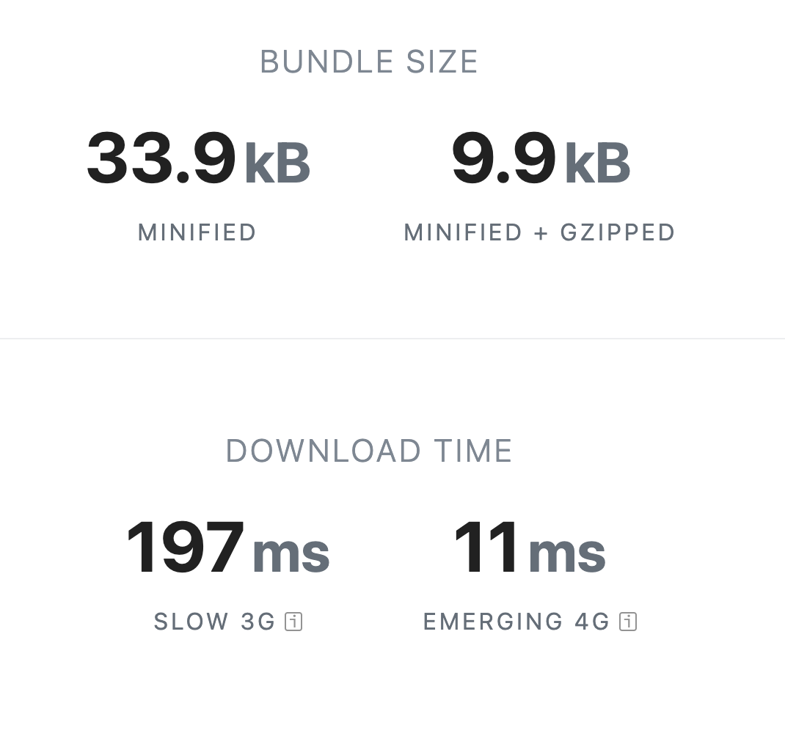
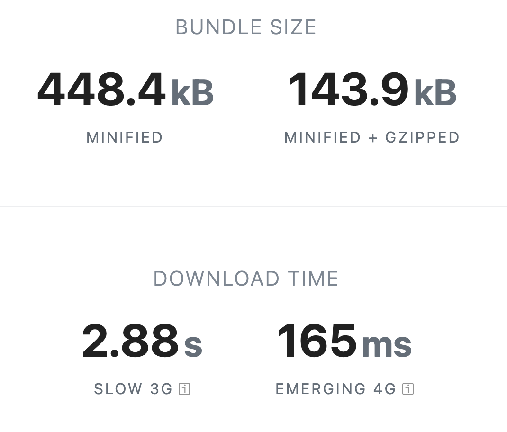
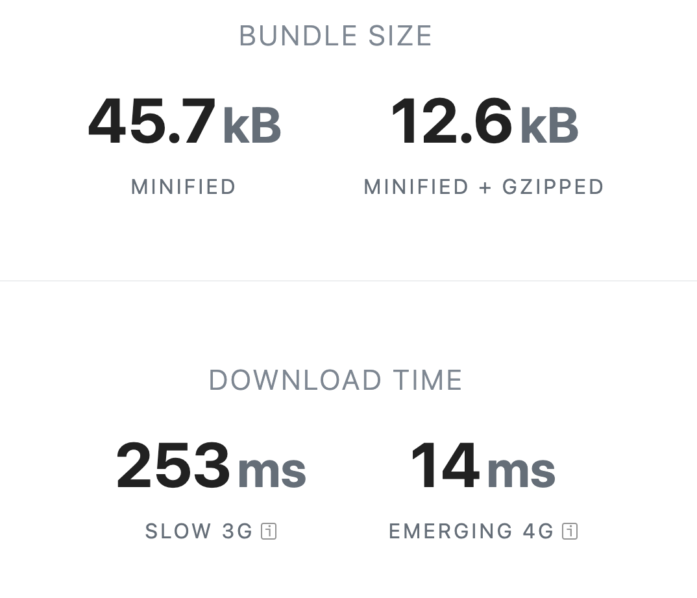
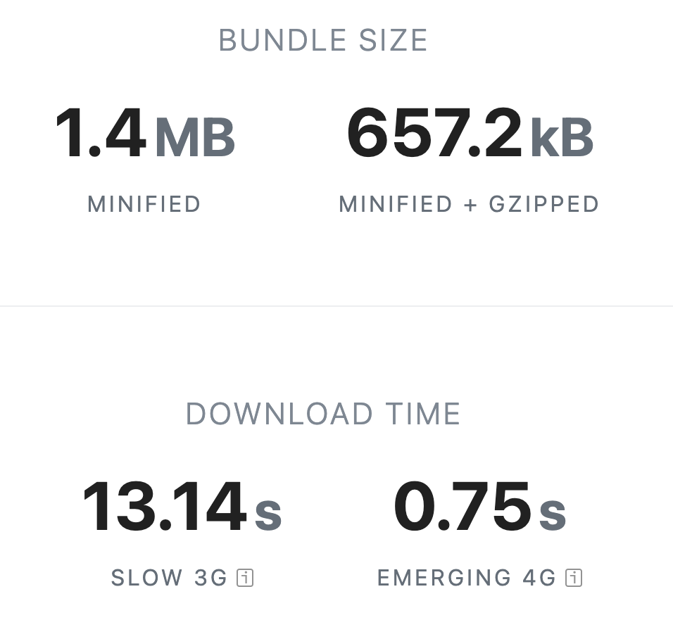

---
# You can also start simply with 'default'
# random image from a curated Unsplash collection by Anthony
theme: ./
# apply unocss classes to the current slide
# https://sli.dev/features/drawing
drawings:
  persist: false
# enable MDC Syntax: https://sli.dev/features/mdc
mdc: true
# take snapshot for each slide in the overview
overviewSnapshots: true
layout: image
image: ./assets/bg.jpg

hideInToc: true
---


<span class="abs-tl text-[8px] top-[3.3rem] left-[3.45rem]  text-zinc-200">Persian Word "Rising Wave"</span>

# KHIZAB

Reactivity for Aptos Apps


  <a href="https://github.com/rendinjast" target="_blank" alt="Rend Github" title="Rend Github" class="abs-br m-6 flex gap-1 border border-zinc-600 bg-black px-2 py-1 rounded-full text-[0.6rem]">
  <span class="text-white">By</span>
    <span>Erfan Khadivar</span>
</a>

---
hideInToc: true
layout: two-cols
---

# Table of contents
::right::
<Toc  listClass="!list-disc toc text-sm" minDepth="1" maxDepth="2" ></Toc>


---

# What is Khizab?

Khizab is a Type Safe, Extensible, and Modular by design **library** for building Reactive Aptos applications


<br>

- 🔗 **Wallet Adapter** - Manage multiple wallets with ease, track the app state in realtime

<br>

- 🛡️ **Type-Safe interfaces** - Infer types from ABIs and autocomplete your way to productivity.

<br>

- ⚛️ **React Hooks** - React Hooks for accounts, wallets, contracts, transactions, signing, and more.

<br>

- 🏗️ **CLI and Codegen** - Create Aptos Frontend projects with one command, Generate boilerplate

<br>

Read more [khizab.dev](https://khizab.dev)


---
level: 2
---

## 🔗 Wallet Adapter

<div class="flex flex-col items-center gap-2">
   
   <span>Khizab</span>
</div>


---
layout: two-cols
level: 3
---

Create your config. 

```ts 
// khizab.ts

import { createConfig } from 'khizab'
import { testnet } from 'khizab/networks'
import { petraWallet } from 'khizab/connectors'

export const config = createConfig({
  network: testnet,
  connectors: [petraWallet()],
})
```

 Khizab Provider

```tsx 

import { KhizabProvider } from 'khizab'
import { config } from '@/khizab'

// add KhizabProvider to your app
 <KhizabProvider config={config}>
 {...}
 </KhizabProvider>
```

::right::

 use Khizab hooks

```tsx {0|all}
useConnect()
useDisconnect()
useReconnect()
useAccount()
```

---
level: 2
---
## 🛡️ Type-Safe interfaces

- Adding typing and reactivity to Aptos SDK functions.

```ts
  const { data, status, error, isPending } = useAccountModules({
    accountAddress: '0x123',
  })
```

- Generate types for your ABI

```ts
const [count] = await readContract(config, {
 abi: abi,
 functionName: 'get_todo_list_counter',
 ags: [account.account.address],
})

```

 -  State of your write or read calls.

```ts
  const { writeContract } = useWriteContract()
writeContract({ 
  abi,
  functionName: 'create_todo_list',
  args: [],
})
```

---
level: 2
---
## ⚛️ React Hooks

<div class="grid grid-cols-4 ">

<span>useAccount</span>

<span>useAccountEffect</span>

<span>useAccountInfo</span>

<span>useAccountModule</span>

<span>useAccountModules</span>

<span>useAccountResource</span>

<span>useAccountResources</span>

<span>useAccountTransactions</span>

<span>useBalance</span>

<span>useBlockByHeight</span>

<span>useBlockByVersion</span>

<span>useClient</span>

<span>useConfig</span>

<span>useConnect</span>

<span>useConnections</span>

<span>useConnectors</span>

<span>useDisconnect</span>

<span>useConnector</span>

<span>useLedgerInfo</span>

<span>useTableItem</span>

<span>useTransaction</span>

<span>useTransactions</span>

<span>useReadContract</span>

<span>useReadContracts</span>

<span>useReconnect</span>

<span>useToken</span>

<span>useWriteContract</span>

</div>

---
hideInToc: true
---

## Core Actions

<div class="grid grid-cols-4 ">
<span>connect</span>

<span>disconnect</span>

<span>getAccount</span>

<span>getAccountInfo</span>

<span>getAccountModule</span>

<span>getAccountModules</span>

<span>getAccountResource</span>

<span>getAccountResources</span>

<span>getAccountTransactions</span>

<span>getBalance</span>

<span>getBlockByHeight</span>

<span>getBlockByVersion</span>

<span>getClient</span>

<span>getConnections</span>

<span>getConnector</span>

<span>getConnectors</span>

<span>getLedgerInfo</span>

<span>getTableItem</span>

<span>getToken</span>

<span>getTransaction</span>

<span>getTransactions</span>

<span>readContract</span>

<span>readContracts</span>

<span>reconnect</span>

<span>watchAccount</span>

<span>watchConnections</span>

<span>watchConnectors</span>

<span>writeContract</span>

</div>
---

React hook Example 


```ts
const { data, status, error } = useBalance({
  accountAddress: account?.address,
  coinType:
     '0x43417434fd869edee76cca2a4d2301e528a1551b1d719b75c350c3c97d15b8b9::coins::USDT',
})

```

Core Action Example

```ts
const usdt = await getBalance(config, {
  accountAddress: account.account.address,
  coinType:
  '0x43417434fd869edee76cca2a4d2301e528a1551b1d719b75c350c3c97d15b8b9::coins::USDT',
})
```

Response

```json
{
    "name": "Tether",
    "decimals": 6,
    "symbol": "USDT",
    "value": 0,
    "formatted": "0"
}
```

---
level: 2
title: 🏗️ CLI and Codegen
---
##  Create Khizab

 Khizab provides a CLI to create frontend projects with bare minimum boilerplate.

```bash
npm create khizab@latest
```

```bash
✔ Project name: … khizab-project
✔ Select a framework: › React
✔ Select a variant: › Next

Scaffolding project in /Users/rend/khizab-project...

Done. Now run:

  cd khizab-project
  pnpm install
  pnpm run dev
```

---
layout: two-cols
---

## Khizab CLI

 The CLI can automatically generate hooks and actions for your smart contract modules.

```bash
pnpm add -D @khizab/cli
```

Creates configuration file. 

```bash
khizab init
```


Generates code based on configuration, using contracts and plugins.

```bash
khizab generate
```

::right::

Modify the configuration file to your needs.

```ts
// khizab.ts
import { defineConfig } from '@khizab/cli'
import { react } from '@khizab/cli/plugins'
import { abi } from './abi'
 
export default defineConfig({
  out: 'src/generated.ts',
  contracts: [
    {
      name: 'TodoList',
      abi,
    },
  ],
  plugins: [
    react()
  ],
})
```


---

# Benefits 
 App developers should not need to worry about connecting tens of different wallets or calling a misspelled contract function, or accidentally spamming the network.


- 🧑‍💻 **Developer Experience** - A key design principle of Khizab is improving the developer experience. Khizab achieves this through a modular architecture similar to Wagmi which promotes simplicity and ease of use.


- ⚡ **Performance** - Performance is a critical factor in any application, and Khizab is optimized to ensure efficient execution. The library is designed to minimize bundle size, with support for tree-shaking and dead-code elimination.


- 🧩 **Feature Coverage** - Khizab supports the most popular and commonly-used Aptos Sdk features out of the box with 20+ React Hooks for accounts, wallets, contracts, transactions, and more.  Khizab also supports just about any wallet out there through it's official connectors, and extendable API.
<br>

Read more [khizab.dev/react/why](https://khizab.dev/react/why)


---
level: 2
---
## 🧑‍💻 Developer Experience


<br />

- Familiar APIs

<br />

- Modular and composable 

<br />

- Automatic type safety

<br />

- Clear documentation.


---
level: 2
---

## ⚡ Performance

###  Users Don't care about Aptos BlockChain Performance

Performance is a critical factor in any application, and Khizab is optimized to ensure efficient execution.
this library is designed to
- minimize bundle size
- support for tree-shaking
- dead-code elimination.

<br />
<br />

Khizab Optimizes data handling by providing built-in support for caching, deduplication, persistence, and much more through TanStack Query.

---
layout: two-cols
---

## @Khizab/core is more than 10X lighter


@khizab/core

::right::


@aptos-labs/wallet-adapter-core


---
layout: two-cols
---

## Khizab is more than 30X lighter


khizab

::right::


@aptos-labs/wallet-adapter-raect

---
level: 2
---
## 🧩 Feature Coverage
most popular and commonly used Aptos SDK features out of the box with 20+ React Hooks for accounts, wallets, contracts, transactions, and more.

<br />

- Khizab also supports just about any wallet through its official connectors and extensible API.


<br />

- If you need lower-level control, you can always drop down to Khizab Core or Aptos SDK, you don't have any limitations.

<br />

---
layout: center
class: text-center
---

# Is it ready?

### let's do a domo


---
layout: two-cols
---
# 🔗 Khizab Connect

Dynamic wallet offering solution based on the current user environment:

- Social passwordless connectors 
- Deep-link and remote connection 
- Custom headless UI 
- User management

::right::

<div class="flex flex-col items-center gap-2">

<span>Telegram Mini App</span>
</div>


---
layout: center
class: text-center
title: end
hideInToc: true
---


<span class="text-white text-center">If you have any questions or want to contribute to this project<br /> feel free to send me a DM on  <a class="text-blue-400">X (@rendinjast)</a> or write an email <a class="text-blue-400" href="mailto:hi@erfan.ee">hi@erfan.ee</a></span>

<div class="text-white mt-12 mb-4 opacity-70">presentation is live at <a href="https://demo-day.khizab.dev" class="text-blue-400">demo-day.khizab.dev</a></div>
<h1 class="mt-0">Thank You!</h1>
<div class="flex gap-12 justify-center ">

<div class="flex flex-col items-center">
<a href="https://khizab.dev" class="text-xs" >

khizab.dev
</a>
</div>
<div class="flex flex-col items-center">
<a href="https://github.com/khizab" class="text-xs" >

github.com/khizab
</a>
</div>
</div>

<PoweredBySlidev abs-b left-2 text-xs />
